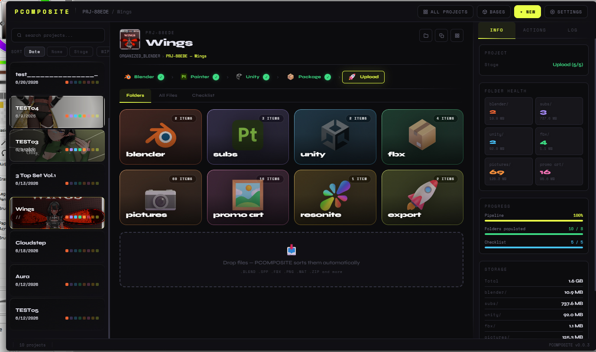
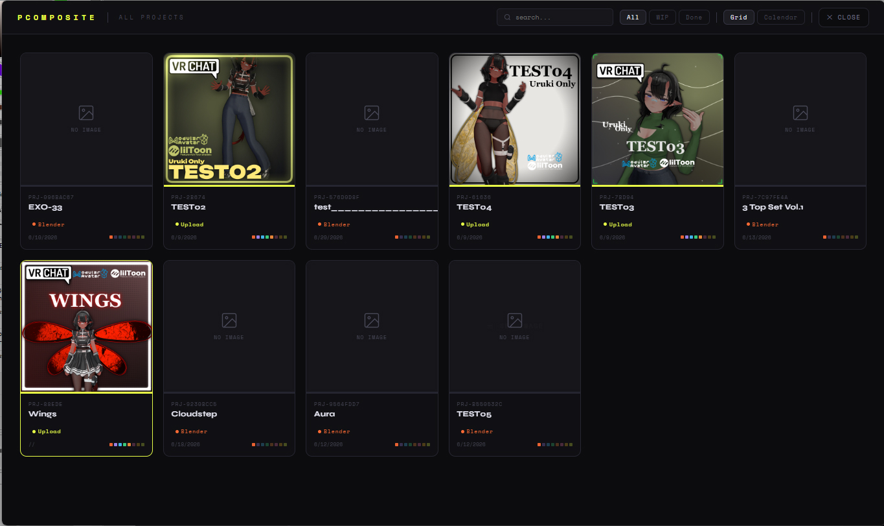
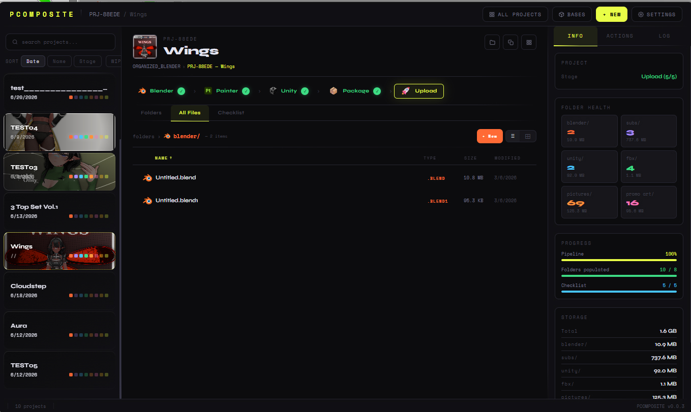

# PCOMPOSITE

A project dashboard for people who juggle **a lot of 3D projects**. Keeps your files organised, tracks where each project is in the pipeline, and connects to Blender so you can import bases straight from the app.

---

## Screenshots

| | |
|---|---|
|  |  |
|  | |

## What it does

- **Project folders on autopilot** — each project gets `blender/`, `subs/`, `unity/`, `fbx/`, `pictures/`, `export/` and whatever else you need. Drop files anywhere and they get sorted into the right folder by type.
- **Pipeline tracker** — a 5-step bar (Blender → Painter → Unity → Package → Upload) that actually moves when you tick things off the checklist. One glance per project.
- **File browser** — browse by folder or dump everything into one view with thumbnails. Click to open in the right app.
- **Bases library** — store character bases (or any reusable assets) in `_bases/` inside your vault. Drag-drop images as cover art, rename groups inline, import into your project directly or send the file to the Blender addon with one click.
- **Blender addon included** — install the addon from the settings page (drag the card into Blender). The addon reads your bases library and lets you import FBX files from inside Blender. PCOMPOSITE can pre-stage an import and focus Blender for you.
- **Export versions** — every time you export an FBX, it gets a version number. Old versions collapse away, the current one stays visible.
- **Gallery** — see all your projects in a grid or calendar, search by name, filter by stage.
- **Streamer mode** — hides file paths and project IDs from the UI if you're sharing your screen.
- **Themes** — dark theme or pink theme, your call.

The whole thing runs locally. No accounts, no cloud, no telemetry.

## Getting Started

1. Download the latest installer from **Releases**
2. Launch PCOMPOSITE
3. Click **Settings → General** and set your **Vault Path** — this is where all your projects live
4. Create your first project with **+ NEW**
5. Start dropping files into the drop zone

## For Developers

### Tech Stack

| Layer | |
|---|---|
| Desktop shell | [Tauri v2](https://v2.tauri.app) (Rust) |
| Frontend | Vanilla JavaScript (ES modules) |
| Bundler | [Vite](https://vitejs.dev) 5.x |
| CSS | Pure CSS with custom properties |
| Storage | JSON files in the OS app data directory |

### Build & Run

Requires **Node.js 18+** and the [Tauri v2 prerequisites](https://v2.tauri.app/start/prerequisites/).

```bash
npm install
npm run dev          # Vite dev server (browser preview)
npm run build        # Frontend production build
npm run tauri dev    # Desktop app with hot reload
npm run tauri build  # Production binaries + installer
```

### Project Structure

```
pcomposite/
├── src/                    # Frontend source
│   ├── main.js             # Entry point
│   ├── state.js            # Shared app state
│   ├── constants.js        # Folder definitions, app icons
│   ├── helpers.js          # Utility functions
│   ├── projects.js         # Project CRUD
│   ├── files.js            # File browser
│   ├── folders.js          # Folder tile grid
│   ├── ui.js               # Tab switching, overlays
│   ├── pipeline.js         # Pipeline step logic
│   ├── checklist.js        # Checklist + session notes
│   ├── gallery.js          # Gallery overview
│   ├── exports.js          # Export versioning
│   ├── bases.js            # Bases library browser
│   ├── settings.js         # Settings overlay
│   ├── bridge.js           # Blender bridge context writer
│   ├── thumbnail.js        # Thumbnail generation
│   └── *.css               # Per-module stylesheets
├── src-tauri/              # Tauri Rust backend
│   ├── src/lib.rs          # Commands (focus Blender, drag addon, file ops)
│   ├── Cargo.toml
│   └── tauri.conf.json
├── public/                 # Static assets, Blender addon
├── media/                  # Screenshots
├── index.html
├── vite.config.js
└── package.json
```

## License

MIT
